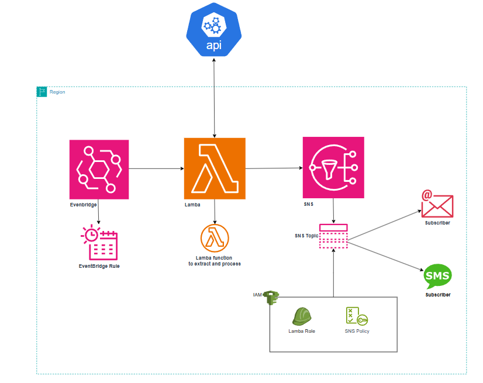

# NBA Game Day Notifications / Sports Alerts System

## Project Overview

This project is a real-time NBA game day notification system that sends score updates via SMS and email. It leverages AWS services (SNS, Lambda, EventBridge), Terraform for Infrastructure as Code (IaC), and the NBA API to provide automated notifications.

## Architecture Diagram

Below is the architecture diagram for the Game Day Notification :



## Features

- Fetches live NBA game scores using an external API.
- Sends formatted score updates to subscribers via Amazon SNS (SMS/Email).
- Automates scheduled updates using AWS EventBridge.
- Implements security best practices with IAM least privilege policies.

## Technologies Used

- **Cloud Provider:** AWS
- **Infrastructure as Code:** Terraform
- **Core AWS Services:** SNS, Lambda, EventBridge
- **Programming Language:** Python 3.x
- **Security:** IAM roles with least privilege policies

## Project Structure

```
Terraform-Gameday-Notification/
├── .gitignore
├── eventbridge.tf        # Terraform config for EventBridge rules
├── iam.tf                # IAM role and permissions for Lambda
├── lambda.tf             # Terraform config for Lambda function
├── main.tf               # Main Terraform configuration
├── nba_notifications.py  # Python script for Lambda function
├── sns.tf                # SNS topic and subscriptions configuration
└── README.md             # Project documentation
```

## Prerequisites

- Free account with subscription and API Key at sportsdata.io
- Personal AWS account with basic understanding of AWS and Python
- AWS CLI installed and configured to your personal account
- Terraform CLI version 1.10.5 installed on your local environment

## Setup Instructions

1. **Clone the Repository**
    ```sh
    git clone https://github.com/your-repo/Terraform-Gameday-Notification.git
    cd Terraform-Gameday-Notification
    ```

2. **Store API Key Securely in AWS Parameter Store**
    ```sh
    aws ssm put-parameter --name "nba-api-key" --value "<API_KEY>" --type "SecureString"
    ```

3. **Deploy Infrastructure Using Terraform**
    ```sh
    terraform init      # Initialize Terraform
    terraform fmt       # Format code
    terraform validate  # Validate configuration
    terraform plan      # Preview changes
    terraform apply     # Deploy infrastructure
    ```

4. **Add Subscriptions to SNS Topic**
    - For Email: Choose "Email" and enter a valid email address.
    - For SMS: Choose "SMS" and enter a valid phone number.
    - Confirm email subscriptions via the received confirmation link.

5. **Test the System**
    - Open the AWS Lambda function in the AWS Management Console.
    - Create a test event to trigger execution.
    - Check AWS CloudWatch logs for execution details.
    - Verify that SMS and email notifications are received.

## Lessons Learned

- Implementing AWS SNS and Lambda for event-driven notifications.
- Securing AWS services with least privilege IAM policies.
- Automating workflows using EventBridge.
- Managing cloud resources efficiently using Terraform.

## Conclusion

This project demonstrates a fully automated, cloud-native approach to delivering real-time NBA game notifications using AWS and Terraform. 🚀